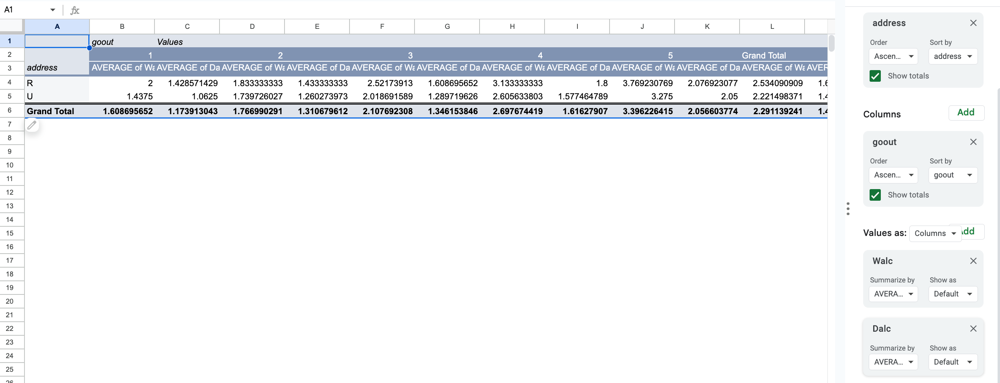

# Final-Project-J124
# J124 Final Project: Understanding the factors that affect student's life
## By: Darren Chiang

### Data Analysis Process
* Download the “Alcohol Effects on Study” [students data](https://www.kaggle.com/datasets/whenamancodes/alcohol-effects-on-study?resource=download&select=Maths.csv) as .csv files, upload it to Google Drive, and open it with Google Sheets.  

_5 Questions with Step by Step Answers on the following Data Sheet_  

**Question 1: How do weekly study times (studytime) and free time after school (freetime) affect both workday alcohol consumption (Dalc) and weekend alcohol consumption (Walc)?**  
1. First press on any cell with data but make sure not to highlight the data. Then select the insert function on the top of the google sheets and press pivot table to create a new pivot table in a new sheet.
2. Once the pivot table is open, select studytime as rows, freetime as columns, and Dalc and Walc using the average function on both as the values. This will allow us to see how weekly study times and freetime affect alcohol consumption on both weekdays and weekends.
3. Make sure to aggregate the values of Dalc and Walc as Average so that we can interpret the average of their relationships rather than summing them up or counting.
4. You may sort the data however you like by pressing the top of the column and selecting the carrot top symbol and pressing filter to filter for A-Z or Z-A. However, there will be no need to filter this data as it is quite short and straight forward.

#### The Pivot Table with its selections should look like this.

#### The full table should look like this.

* As shown, the pivot table indicates that as studytime increases from 1 to 4, there is a general trend of reduced average workday alcohol consumption (Dalc) and weekend alcohol consumption (Walc). The data might be easily misinterpreted if you compare it incorrectly. You are supposed to compare weekday consumption to weekend consumption and not simply compare them all together becuase there are two columns, which may it a bit confusing! This suggests that students who dedicate more time to studying tend to consume less alcohol on both weekdays and weekends. Additionally, we can conclude that students with not a lot of free time (freetime=1), there seems to be a decrease in average alcohol consumption as studytime increases. Conversely, for students with a lot of free time (freetime=5), the pattern of alcohol consumption remains relatively consistent across different studytime levels. It is evident that students who are able to make a healthy balance between study and leisure time (moderate studytime and freetime values) generally demonstrate moderate alcohol consumption. This could potentially infer that maintaining a healthy balance between academic commitments and personal time requires one to be more responsible with their alcohol consumption.

  

**Question 2: Is there a relationship between the quality of family relationships (famrel) and students' health status (health), and does this association differ based on their romantic relationship status (romantic)?**  
1. Repeat steps from question 1 explaining how to create a pivot table.
2. Set famrel as rows, health as columns, and romantic as values.
3. Aggregate the values (romantic) using count
#### The full table should look like this.

* From the pivot table below, we can see that students with better family relationships (higher famrel values) generally tend to have better health (higher health values). The counts of students with higher family relationship ratings (famrel 4 and 5) are more prevalent in the higher health status categories (health 4 and 5). This can be seen from the positive correlation between family relationship quality and student health. As family relationship quality improves, students' health status tends to improve as well. Moreover, students with both low and high family relationship ratings (famrel 1 and 5) tend to have fewer romantic relationships (romantic=no). However, we cannot strongly conclude that the presence of romantic relationships might not significantly affect the relationship between family relationship quality and health status. On the other hand, the data suggests that family relationships may play a central role in influencing the well-being of students, regardless of whether they are in romantic relationships. I would like to caveat that although there is strong, positive correlation that support my answer to this question, there is missing data (amrel 1 and health 2, 4) that could potentially make the correlation less strong. 

  

**Question 3: How does the number of past class failures (failures) relate to students' weekly study times (studytime) and their internet access at home (internet)?**  
1. Repeat steps from question 1 explaining how to create a pivot table.
2. Select failures for rows, studytime for columns, and internet as values
3. Aggregate the internet values by count.

#### The full table should look like this.

* From the data above, we can see that students who have higher weekly study times (studytime 2, 3) and access to the internet at home (internet=yes) tend to have lower counts in the "failures'' category. This suggests that students who study more AND have internet access at home might be less likely to experience past class failures. Across all levels of weekly study times (studytime), students with fewer past class failures (failures 0) have higher counts compared to those with more past class failures (failures 1, 2, 3). Notice that the students with the highest counts of failure have missing data. Although the data does not directly show this, I believe that it is plausible that the reason why they have no data in study times of 3-4 is due to the fact that these students do not study as well, hence the greater amount of failures they have experienced in school. While there is a general trend of lower failures counts among students with internet access, it is worth noting that students with internet access still fall into all levels of past class failures. To reiterate, students with more frequent weekly study times (studytime 2, 3) seem to have relatively better academic performance, as indicated by their lower past class failures counts. While there is a relationship between past class failures and weekly study times, as well as internet access, this relationship doesn't necessarily imply causation because there are other factors that we must take into account to truly understand a student's failures.

  

**Question 4: What is the impact of extra educational support (schoolsup) and family educational support (famsup) on student absenteeism (absences), and does this pattern differ by their going-out behavior (goout)?**  
1. Repeat steps from question 1 explaining how to create a pivot table.
2. Select schoolsup and famsup as rows, goout as columns, and absences as values.
3. Aggregate the absences value using the average function

#### The full table should look like this.

* From the pivot table we have created above, we can see that in general, students who receive both extra educational support (schoolsup) and family emotional support (famsup) tend to have lower average absences compared to those who receive neither or only one of these types of support. This suggests that a combination of school-based and family-based support might contribute to better attendance. Similarly, for students who do not receive extra educational support or family emotional support (no-no), lower levels of going out behavior (goout) seem to correlate with fewer average absences. On the other hand, for students who receive both types of support (yes-yes), the relationship between going out behavior and absences is less consistent. Because we were only able to identify a general trend and not a very strong correlation, it is saef to assume that the impact of going out behavior on absences appears to vary based on whether students receive different combinations of support. While students receiving support might have generally higher absences with higher going out behavior (goout), the pattern is not as straightforward for every student. The relationship between going out behavior and absences is influenced by multiple factors, (including the presence of support systems) but whether or not an individual student is directly impacted by these support systems is also important to consider. Therefore, the complexity of these factors can make it challenging to predict absences solely based on going out behavior and support received.

### Data Visualization
  
The link to this data visualization is [datawrapper](https://datawrapper.dwcdn.net/tCZhD/2/). This clustered bar chart represents the average student absences depending on whether the student receives support from their school/family. This illustration matches with the findings above and show that for the most part, students who are supported by both their family and school have relatively low absences. On the other hand, students with no support tend to have high amount of absences. There is confusion when students receieve family support but not school support because there is suddenly a lot more absences in this cluster of bars. However, we do not know enough to make any inferences on this case and can only assume that there were outliers that drastically affected our data.

  

**Question 5:**Question:** How does the student's home address type (address) influence their going-out behavior (goout) with friends, and how does this interaction affect both workday alcohol consumption (Dalc) and weekend alcohol consumption (Walc)?**  
1. Repeat steps from question 1 explaining how to create a pivot table.
2. Select address as rows, goout as columns, and Dalc and Walc as values.
3. Aggregate the values Dalc and Walc by average so that we can easily compare the averages of the two values.

#### The full table should look like this.

* From the pivot table above, we can see that students with urban home addresses (address=U) tend to have slightly higher average going out behavior (goout) compared to students with rural home addresses (address=R). This suggests that students living in urban areas might be more inclined to engage in social activities and spend time outside with friends. This is pretty reasonable since there is more access to malls, cafes, and convenient, local places to gather while kids who reside in rural areas might have other responsibilities that they are obligated to tend to. There is a general trend of higher average alcohol consumption, both workday alcohol consumption (Dalc) and weekend alcohol consumption (Walc), among students who have higher going out behavior (goout). Interestingly, regardless of home address type, students who go out more frequently tend to have higher alcohol consumption levels. In our previous questions, we learned that students who go out more tend to have more failures in school and tying in our data from this question, it is not a stretch to assume that going out and drinking alcohol negatively impacts their academics. To further strengthen this argument, we can see that students with urban home addresses (address=U) generally exhibit slightly higher average alcohol consumption (both Dalc and Walc) compared to those with rural home addresses (address=R). This could be due to the fact that students in urban areas might have easier access to social venues and experiences that could influence their alcohol consumption habits. It is important to keep in mind that the interaction between home address type, going out behavior, and alcohol consumption is dependent on multiple factors (some of which are not in the data). It involves individual preferences, local culture, and accessibility to social opportunities.

  

 ### Short Summary and Sourcing

 
The goal with this data is to illustrate that there are many factors that affect a student’s academic career and to evaluate how each individual factors that were selected for each question may pose difficulties on students’ ability to succeed in their studies.

The data analysis reveals significant insights into student life, evaluated across various factors. As we examine the patterns, we uncover compelling trends that shed light on how certain aspects of student behavior and circumstances are interconnected.

Firstly, the pivot table clearly illustrates that students who dedicate more time to studying (studytime) demonstrate a corresponding decrease in average alcohol consumption, both on weekdays (Dalc) and weekends (Walc). This correlation implies that higher study commitment is associated with responsible alcohol consumption habits. Furthermore, the relationship between study time and alcohol consumption appears to be influenced by free time (freetime). Students with minimal free time tend to reduce their alcohol consumption as study time increases, suggesting a prioritization of academic engagement over leisure activities. Conversely, those with abundant free time maintain consistent alcohol consumption levels regardless of study time. This emphasizes the importance of balancing academics and personal time for a moderate approach to alcohol consumption.

Moreover, the data indicates a strong positive correlation between the quality of family relationships (famrel) and student health (health). Higher family relationship ratings coincide with better health statuses, underlining the significant impact of family dynamics on student well-being. Additionally, family relationship quality seems to affect the prevalence of romantic relationships (romantic), with both low and high famrel ratings correlating with fewer romantic involvements. This suggests that strong family relationships may contribute to overall student contentment and potentially influence their romantic pursuits.

Furthermore, students who engage in higher weekly study times and have internet access at home exhibit fewer class failures. This suggests that increased study efforts combined with home internet access contribute to better academic performance and a lower likelihood of past class failures. Although a general trend exists, caution is warranted due to missing data for certain failure categories.

Lastly, the home address type (urban vs. rural) appears to influence students' social behaviors and alcohol consumption habits. Urban students, with greater access to social venues, tend to engage in higher going out behavior and consequently exhibit slightly higher alcohol consumption. This connection between urban living, social activities, and alcohol consumption implies that local context and accessibility impact students' choices.

From this data analysis, students are able to gain valuable insight on potential factors that they could change in order to enhance their academic performance such as avoiding drinking, developing healthy family relationships, and to avoid being absent. 

This data on “Alcohol Effects on Study” was collected by Paolo Cortez, a member of the University of California, Irvine Student Performance, in 2008 at Cortez and Silva (Portugal) in two secondary Portuguese schools and later published by the UCI Machine Learning Repository.

### Credible Contacts
Sworn in on March 2, 2021, Miguel A. Cardona is the Secretary of Education who oversees the education system of the United States. Herves as the principal advisor to the president of the United States, and the federal government, on policies, programs, and activities related to all education in the United States. An interview with him would provide greater, deeper insight on how students can improve their academic careers and what factors are deterrants to the education of our students.

Additionally, another great person that could help uncover what holds our students back from succeeding is the school therapist since they hold the power to build rapport and understand our students on a deeper level whether it be through counseling, interactions, or even group activities that help students feel welcomed and supported.

### Additional Resources
1. A great resource that could provide us with different ways to tackle the pressing issues that prevent students from succeeding is [Learning A-Z](https://www.learninga-z.com/site/resources/breakroom-blog/data-in-education) since it breaks down many of the determinants of a child's success in school.

2. A good dataset to use would be [nations report card](https://www.nationsreportcard.gov/) becuase they have up to date statistics and information on the education level of students of all grades in each and every state. It would be very helpful to compare the data in this story to that of another state to see if they match up.

